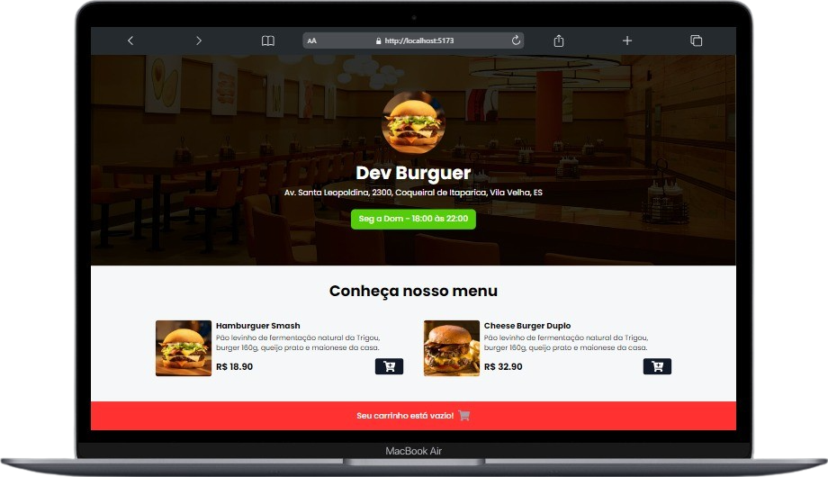
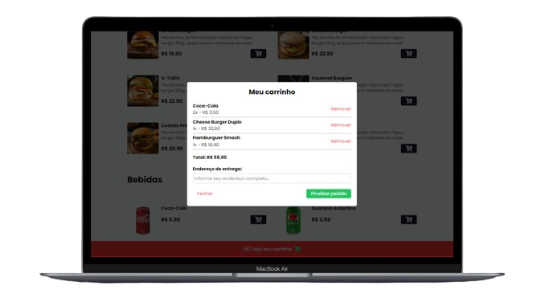
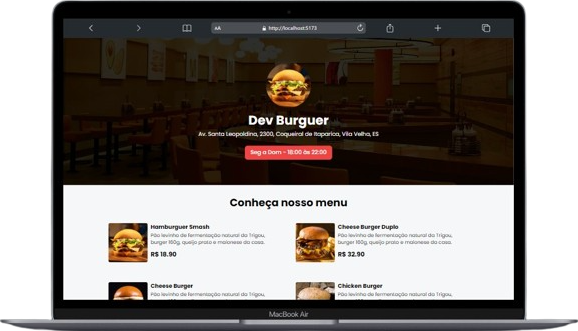

## Hamburgueria Dev

Este é um simples sistema de pedidos para uma lanchonete, desenvolvido com [Vite](). Os frameworks utilizados para o desenvolvimento foram:

✔ React
✔ Typescript
✔ Tailwind CSS
&nbsp;

## 👨🏻‍💻 Começando...

Primeiro, execute os seguintes comandos no cmd da sua IDE:

```bash
npm install
```

```bash
npm run dev
```

👍🏻 Execute o projeto no navegador a URL `localhost://5173`

---
## 💻 Layouts do projeto

- Home page

| Desktop | Mobile | 
|--|--|
| | |

##
- Cart page

| Desktop | Mobile | 
|--|--|
| | |

##
- Home page - Pedido fechado

| Desktop | Mobile |
|--|--|
| | |